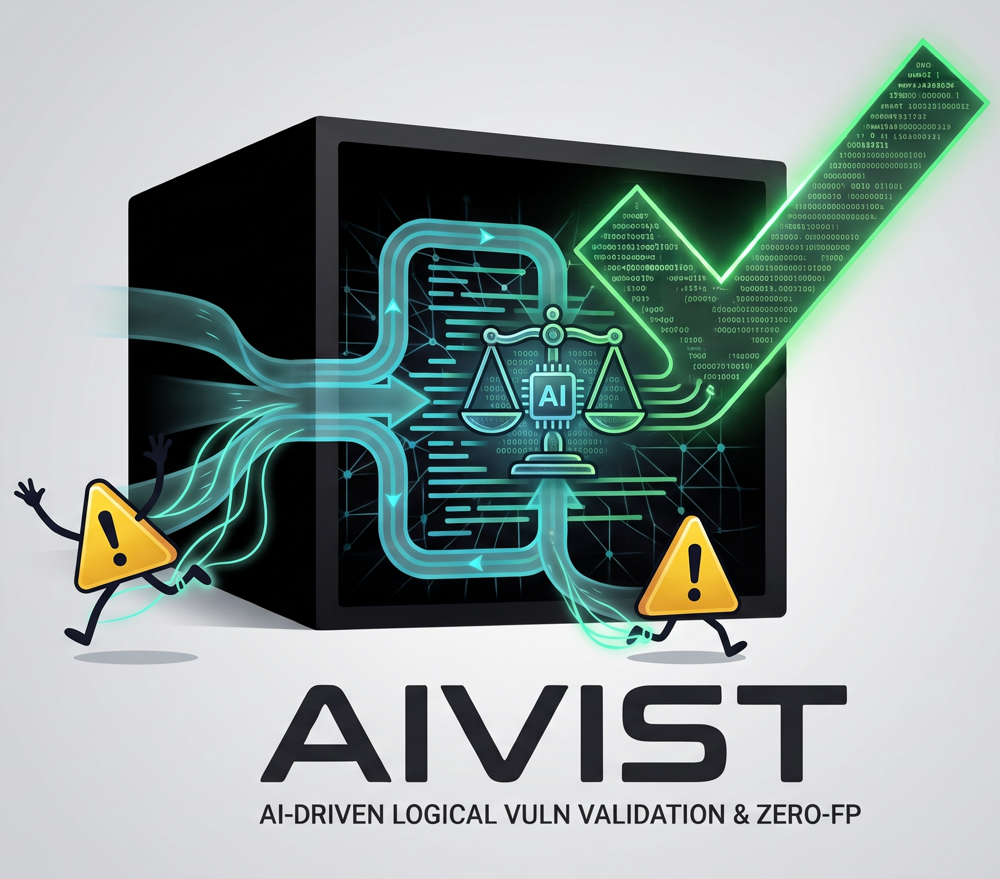

<!-- Drop your logo at docs/assets/logo.png (or update the path below). -->
<p align="center">
  
</p>

<h1 align="center">Aivist Verify</h1>

<p align="center">
  <em>A BOLA/IDOR access-control confirmation engine — <strong>code</strong> adjudicates every verdict, not the model, and each confirmation ships with a reproducible evidence chain.</em>
</p>

<p align="center">
  
  
  
</p>

---

Aivist Verify doesn't just flag candidates — it **confirms** whether one user can actually reach another user's resource. Every verdict is adjudicated by **code, not the model**: the AI can *propose* a finding, but a deterministic, **downgrade-only** gate decides what counts as a real violation. So the model can never talk the tool into a false positive, and every confirmation carries a **reproducible evidence chain you can re-run yourself**.

It runs **locally**, from the command line, against **authorized targets you control**.

## What it is — and what it isn't

**It is** a *confirmation* engine for Broken Object-Level Authorization (BOLA / IDOR — OWASP API Security Top 10, and Broken Access Control in the OWASP Top 10). You point it at a candidate — an endpoint plus two identities — and it tells you, with proof, whether the attacker identity actually crosses a user boundary into the owner's resource.

**It is not:**

- **Not a scanner.** Scanners are good at surfacing *maybe*. They crawl and flag suspected IDORs that you still have to verify by hand. Aivist Verify is the layer *after* that: feed it a candidate, and it returns a confirmed verdict with evidence — or an honest "not confirmed." It doesn't add to the pile; it clears it.
- **Not a red-team / exploitation tool.** It confirms reachability across a user boundary for blue-team verification. It is not built to weaponize or mass-exploit.
- **Not a magic box.** It runs against locally-hosted targets, it has no authentication of its own, and it only ever tests what you point it at, with credentials you supply. See [Scope & safety](#-scope--safety).

### Why this exists

Two kinds of tools sit around this problem, and both leave a gap:

- **Open-source scanners** flag candidates and — often explicitly — leave confirmation to you. A list of *suspected* IDORs is still a day of manual verification.
- **Closed SaaS validators** do run exploitability checks, but the logic is a black box, the finding is a report you can't independently reproduce, and "fewer false positives" is a statistical promise, not a structural guarantee.

Aivist Verify occupies the gap between them: **open-source and local**, a **structural** zero-false-positive design (the code gate can only *downgrade* the model's opinion, never invent a `verified`), and an **evidence chain any reviewer can re-run**. That combination — not any single feature — is the point.

## How it works — the moat

Confirmation runs in two layers, and **both are adjudicated by code**:

```
 candidate (endpoint + attacker/owner identities)
        │
        ▼
 [ AI proposes ]   the model reads the traffic and proposes a candidate verdict
        │           (it can request ONE extra piece of evidence, executed for real)
        ▼
 [ CODE disposes ] a deterministic gate re-checks the proposal against the
        │           attack's own runtime bytes. It can ONLY DOWNGRADE:
        │           a `verified` survives only if a structural exemption,
        │           computed in code, actually holds. The model's say-so is
        │           never one of the inputs.
        ▼
 verdict  +  reproducible evidence chain
 (what the attacker sent, what the owner-view read,
  which code rule decided, and a curl you can replay)
```

The result records the model's **raw** verdict *and* the code gate's decision **separately** — so the evidence chain literally reads "model said X, code decided Y." The verdict a user sees is never manufactured by the model, and never manufactured by the CLI.

**Why "downgrade-only" matters, measured:** across every SECURE control case in the benchmark below, the model's raw output asked for `verified` on **79 runs** — and the code gate refused **every single one**. On the read-semantic shape it flipped to `verified` once where, without the gate, it *would have been a false positive*. The line is held by code, not by the model happening to behave.

## Quickstart

You need Python 3.11+ and a Gemini API key (`GEMINI_API_KEY`). Then:

```bash
pip install -e .          # installs the `aivist` command (see Installation below)
aivist config             # choose provider, paste your API key (hidden), pick a model
aivist demo               # zero-setup: confirm a BOLA on the built-in lab — no Docker, no target, no tokens
```

`aivist demo` spins up a built-in vulnerable lab, runs a real cross-user attack with two identities, and prints a confirmed verdict with its full evidence chain. It's the fastest way to see exactly what a confirmation looks like — and because it's built-in, anyone who clones the repo can reproduce it.

To confirm on your **own** locally-running target, the shortest path is the interactive console:

```bash
aivist                    # opens the console; `demo`, `help`, `config`, `target`, `targets`, `verify`, `scan`
```

…or drive it non-interactively (see [Installation & full usage](#installation--full-usage)).

## Example output

Here is a real `aivist demo` run — a confirmed cross-user write on the built-in lab. Note that the verdict is authorized by a **deterministic code channel**, and the model's raw opinion is explicitly recorded as *not* the basis:

<details>
<summary>Full <code>aivist demo</code> output (verbatim)</summary>

```text
Aivist Verify demo - confirming a real BOLA on the built-in lab (no Docker, no target, no tokens to supply).
Booting a local vulnerable app and confirming one cross-user access bug end-to-end...

[CONFIRMED]  cross-user write (BOLA) - POST /api/users/1/display-name
  Verdict: verified  (confirming channel: write-record read-back)  (guard_override=write_record_readback_decisive)
  Basis: a deterministic code gate authorized this (write-then-independent-read proof), not the model's opinion alone.
  What the engine proved:
    Wrote as the attacker, then read the object back through a different
    endpoint as another identity. A record carrying the victim's object id and
    the exact value this attack wrote was found on that read-back, so the
    unauthorized write provably persisted. That persisted read-back is the
    proof.
  Here's what happened - the Evidence chain (physical bytes the engine actually exchanged):
    1. Sent as the attacker:
       POST http://127.0.0.1:8001/api/users/2/display-name
       Content-Type: application/json
       Authorization: ***REDACTED***
       Body: {"display_name": "vm-1-be010bcd9f"}
    2. Attack response received:
       -> HTTP 200 | Content-Length: 15
       {"status":"ok"}
    3. What decided it (byte-level):
       - the write was attributed to the attacker's own identity  (caller_identity=same_as_caller)
       - this attack's unique value was present in the read-back body - the write landed  (payload_causality=confirmed_in_body)
       - the anchoring read-back path was not found (observe-only)  (anchoring_result=failed_path_not_found)
    4. Not taken as proof:
       - the model's raw opinion alone did NOT decide this - the deterministic code channel did  (ai_verdict_raw=verified)
  Re-runnable evidence package (fill <REDACTED> from YOUR config; never a live token):
    # 1) The attack request - reproduces the cross-user access AS THE ATTACKER:
    curl -X POST 'http://127.0.0.1:8001/api/users/2/display-name' \
    -H 'Content-Type: application/json' \
    -H 'Authorization: <REDACTED>' \
    --data '{"display_name": "vm-1-be010bcd9f"}'
  So what / Next step:
    A real cross-user access bug: the attacker could write to the victim's
    object. It is reproducible (the request above).
    Next: report it, or fix by enforcing an ownership check on this endpoint.
  [lab oracle] lab label=REAL (expects verified); engine said 'verified' - AGREES. (informational only; NEVER an input to the verdict)
```

</details>

> The lab's display-name value (`vm-1-…`) is a fresh high-entropy token generated per run, so your own `aivist demo` will show a different one — the labels and channel are what stay fixed.

And — just as important — the tool is honest when it *doesn't* confirm. A run where the attacker gains nothing returns `[REFUTED]` — verdict `inconclusive`, "the code gate held the line — no cross-user effect confirmed." A run that gets rate-limited or hits an expired token returns `[NOT DATA]` and claims **no verdict at all** — it is neither safe nor vulnerable. The engine refuses to guess.

## Installation & full usage

### Install

```bash
git clone <your-repo-url>
cd aivist-verify
pip install -e .
```

This registers the `aivist` command. Configuration (your API key and saved targets) lives under `~/.aivist/`. Set your model provider key once with `aivist config`, or export `GEMINI_API_KEY`.

### The subcommands

**`aivist verify` — confirm a single finding.** Two modes:

```bash
# LAB mode: confirm against a built-in caseset (ground-truth benchmark)
aivist verify --caseset <caseset.json>           # confirm every case in the set
aivist verify --caseset <caseset.json> --case <id>

# EXTERNAL mode: a locally-run REAL target = base URL + OpenAPI spec + one operation
aivist verify \
  --target http://localhost:8888 \
  --spec   ./openapi.json \
  --op     ./operation.json          # {method, baseline_path, body, payload, shape}
# optional: --auth ./login.json for automatic re-login instead of static tokens
```

**`aivist target` — save a reusable target as one editable file.**

```bash
aivist target --dump-template ./mytarget.txt   # write a fully-commented form
# fill it in, then:
aivist target --from-file ./mytarget.txt        # validates ALL fields at once; saves nothing if any is invalid
```

**`aivist scan` — non-interactive auto-discovery + confirm.** Works from an OpenAPI spec *or* spec-less:

```bash
# from a saved target file; tokens from env (or --tokens-file)
aivist scan --target-file ./mytarget.txt

# SPEC-LESS: give it an endpoints list, a captured-traffic file, or a live proxy
aivist scan --target-file ./mytarget.txt --endpoints-file ./endpoints.txt
aivist scan --target-file ./mytarget.txt --traffic-file   ./capture.har     # browser/Burp HAR or raw-HTTP dump
aivist scan --target-file ./mytarget.txt --capture                          # live mitmdump proxy (needs mitmproxy)

# surface "broken for all" findings for human review instead of suppressing them
aivist scan --target-file ./mytarget.txt --assert-owner-only
```

**`aivist run --config` — the professional, fully non-interactive entry (CI / scripting).** JSON in, structured JSON to stdout. **This is the main path for automated use** — no prompts, tokens read from the environment only:

```bash
aivist run --config ./config.json            # emits machine-readable JSON on stdout
aivist run --config ./config.json --pretty   # + a short human summary on stderr (stdout stays pure JSON)
```

The config selects `mode=verify|scan`, the base URL, and the endpoint/ids or scan catalog source. **Tokens are never read from the config file** — only from the environment. Run `aivist run --help` for the exact schema.

### Tokens

All three roles are read from environment variables (or, for `scan`, an optional `--tokens-file` that is read at use-time and never persisted):

```bash
export TARGET_ATTACKER_TOKEN=...    # the attacker identity (the attack is sent as this account)
export TARGET_OWNER_TOKEN=...       # the victim/owner (re-read only, as the owner)
export TARGET_BYSTANDER_TOKEN=...   # a third account that does NOT own the resource (tells a shared resource from a real leak)
```

The interactive console reads these automatically and shows a masked "from environment" receipt; it never echoes or logs a token.

## Zero-false-positive evidence — and how to reproduce it

The headline claim is *reproducible zero-false-positive confirmation*. That claim is only worth as much as your ability to check it, so here is the evidence and exactly how to re-run it yourself.

**The benchmark (controlled, not real-world).** Five confirmation shapes — cross-user write, read-type semantic equivalence, silent-write / object-state, delete / negative-assertion, and mass-assignment / low-entropy state-jump — are exercised against **two structurally different self-contained vulnerable labs** (`vulnerable_target/` and `depot_target/`), driven by a **real** `gemini-2.5-pro` loop, with **N=20** SAFE/control and **N=10** VULN per case, freshly seeded every run.

| | Result |
|---|---|
| SAFE / control runs → **final `verified`** | **300 → 0** — zero false positives |
| VULN runs → **final `verified`** | **130 → 130** — every real vulnerability caught, via its expected channel |
| Usable runs | **430 / 430**, zero degraded |
| Model raw-said `verified` on SAFE, refused by the code gate | **79 / 79** |

These are **controlled lab targets, freshly seeded** — a benchmark that proves the *code gate is not moved by the model*, **not** a tally of real-world kills. Real-world clean confirmations are genuinely rare; this project's honest headline is **discriminative power + a zero-false-positive discipline**, not a screen full of `CONFIRMED`.

**Three independently verifiable layers** (you don't have to trust a transcript):

```bash
# Layer 1 — the labs' own ground truth, NO API key. The engine is graded against these, never the reverse.
python -m pytest vulnerable_target/test_vulns.py -q
python -m pytest depot_target/test_vulns.py -q

# Layer 2 — the structured result artifacts, NO API key. One JSON row per run: raw verdict → final verdict,
# which exemption fired, every anchor, and a per-row regression check. Small and diffable.
#   scripts/measure/results/sweep_highN.jsonl

# Layer 3 — regenerate Layer 2 from Layer 1 with YOUR OWN Gemini key (≈430 calls for the full pass).
python scripts/measure/verdict_measure.py \
  --caseset scripts/measure/casesets/vulnerable_target.json \
  --caseset scripts/measure/casesets/depot.json \
  --n-safe 20 --n-vuln 10 --out scripts/measure/results/sweep_highN.jsonl
```

For the full case-by-case matrix and the documented **bounds** of each channel (notably the read-semantic gate's calibration limits), see [`RESULTS.md`](./RESULTS.md) and [`REPRODUCE.md`](./REPRODUCE.md).

## Repository layout

```
aivist-verify/
├─ run.py                    # CLI entry point (the `aivist` command)
├─ README.md                 # you are here
├─ RESULTS.md                # the zero-false-positive benchmark, case by case
├─ REPRODUCE.md              # reproduce the evidence — three independent layers
├─ backend/app/
│   ├─ services/             # the confirmation engine: differential oracle, deep verifier, exemption gates
│   └─ cli/                  # the command line and interactive console
├─ vulnerable_target/        # a self-contained lab + its own independent ground-truth test suite
├─ depot_target/             # a second, structurally different lab + ground-truth suite
├─ scripts/measure/          # the measurement harness + committed result artifacts (sweep_*.jsonl)
└─ docs/                     # architecture and engine documentation
```

## Documentation

- [`RESULTS.md`](./RESULTS.md) — the full zero-false-positive benchmark, case by case, with each channel's documented bounds.
- [`REPRODUCE.md`](./REPRODUCE.md) — reproduce the evidence yourself, three independent layers.
- [`docs/PROJECT_OVERVIEW.md`](./docs/PROJECT_OVERVIEW.md) — what exists today and how the pieces fit together.
- [`docs/ARCHITECTURE.md`](./docs/ARCHITECTURE.md) — how the engine is built.
- [`docs/VERIFY_ENGINE.md`](./docs/VERIFY_ENGINE.md) — the differential oracle and the deep verifier, in depth.

## Capabilities & honest limits

**Supported (built and audited in-repo):** OpenAPI-spec and spec-less discovery (manual endpoint lists, HAR / raw-HTTP traffic parsing, live mitmproxy capture); static-token *and* automatic re-login auth flows; a challenge/rate-limit circuit-breaker that aborts to `NOT DATA` rather than hammer a target; and the fully non-interactive `run --config` entry for CI.

**Honest limits:**

- The zero-false-positive record is measured on **two controlled labs**, not validated at scale across diverse real-world targets. "Supports X" means the capability exists and is audited — not that it has been battle-tested in the wild.
- The AI layer currently targets a **single provider** (Gemini via the `google.genai` SDK); there is no provider-abstraction layer yet.
- The read-semantic confirmation gate has **documented bounds** (threshold calibrated on deterministic lab data; public/shared resources are a residual gap). See `RESULTS.md`.
- The tool itself has **no authentication** and is designed for **localhost** targets. It is not, and is not intended to be, an internet-facing or mass-scanning service.

## ⚠️ Scope & safety

**Read this before pointing it at anything.**

- **Authorized targets only.** Only run Aivist Verify against systems you own or have **explicit written permission** to test. Confirming a BOLA/IDOR sends real cross-user requests with real credentials. Unauthorized testing may be illegal.
- **Localhost / self-hosted targets.** The tool is built and tested for locally-run targets you control. It is not a tool for scanning third-party or internet-facing systems.
- **No authentication of its own.** Aivist Verify has no access control around itself. Do not expose it as a service. Run it locally.
- **You supply the credentials.** It only ever acts as the identities whose tokens you provide, against the single target you point it at.

A tool whose entire value is *honesty* has to be honest about its own boundaries. The narrower and more clearly-stated the scope, the more the zero-false-positive discipline can be trusted.

## License & status

**Status:** pre-release. The confirmation engine and its evidence are stable; interactive-CLI polish is ongoing.

**License:** MIT — see [`LICENSE`](./LICENSE).

---

<p align="center"><sub>Aivist Verify confirms; it does not merely flag. Code adjudicates; the model only proposes.</sub></p>
